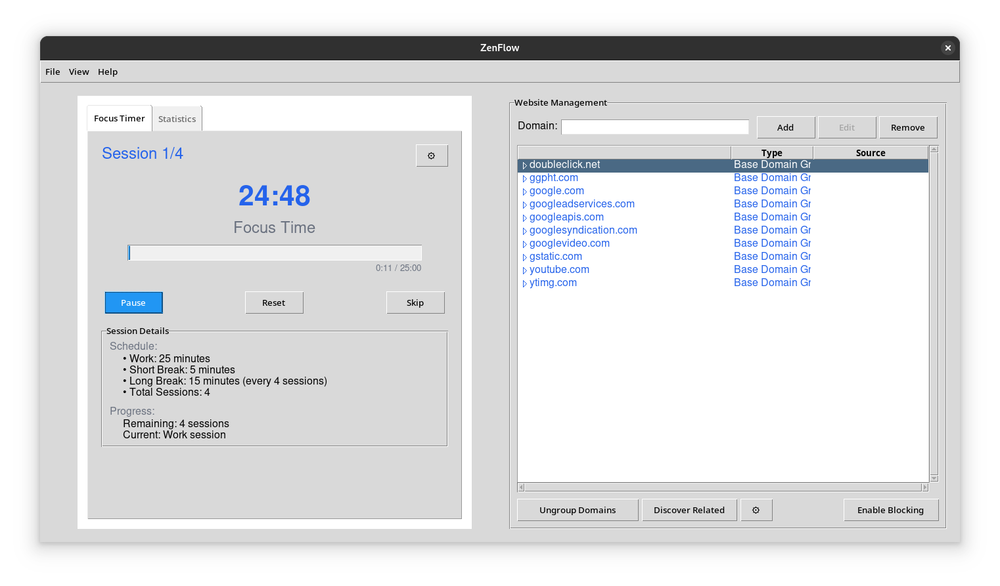

# ZenFlow

A powerful productivity suite that combines intelligent website blocking with focus management to help you achieve your optimal flow state. ZenFlow creates a distraction-free digital environment, enabling deep work and enhanced productivity.



## Features

- 🛡️ Intelligent Website Blocking: Network-level filtering with automatic domain discovery
- ⏱️ Focus Timer: Customizable work/break sessions based on the Pomodoro Technique
- 📊 Progress Analytics: Detailed statistics and insights about your focus sessions
- 🎯 Goal Setting: Daily focus goals and streak tracking
- 🔄 Smart Break Management: Automated break scheduling to maintain productivity
- 💾 Persistent Settings: Your preferences and statistics are automatically saved
- 🖥️ Modern UI: Clean, intuitive interface designed for minimal distraction

## Quick Installation

```bash
# Clone the repository
git clone https://github.com/anassk01/zenflow.git
cd zenflow

# Run the installation script (requires root privileges)
sudo ./install.sh
```

The installation script will automatically:
- Install all required system dependencies
- Set up Python virtual environment
- Install Python packages
- Create necessary directories
- Add desktop entry and command-line launcher

## Running ZenFlow

After installation, you can run ZenFlow in two ways:

1. **From the Applications Menu**
   - Find and click on ZenFlow in your system's application menu

2. **From Terminal**
   ```bash
   zenflow
   ```

The application requires root privileges and will prompt for your password when needed.

## Manual Installation

If you prefer to install manually or the automatic installation fails, follow these steps:

### 1. System Dependencies

#### Ubuntu/Debian
```bash
sudo apt-get update
sudo apt-get install python3-dev python3-pip python3-venv libnetfilter-queue-dev chromium-browser chromium-chromedriver build-essential iptables
```

#### Fedora
```bash
sudo dnf install python3-devel python3-pip libnetfilter_queue-devel chromium chromium-headless chromedriver gcc iptables
```

#### Arch Linux
```bash
sudo pacman -Syu python-pip python-virtualenv libnetfilter_queue chromium gcc iptables
```

### 2. Manual Setup

```bash
# Create installation directory
sudo mkdir -p /opt/zenflow
sudo cp -r . /opt/zenflow/

# Create and activate virtual environment
cd /opt/zenflow
python3 -m venv venv
source venv/bin/activate

# Install Python dependencies
pip install -r requirements.txt

# Create user directories
mkdir -p ~/.config/zenflow
mkdir -p ~/.local/share/zenflow

# Create desktop entry
sudo cp resources/zenflow.desktop /usr/share/applications/

# Create launcher script
sudo tee /usr/local/bin/zenflow << EOL
#!/bin/bash
source /opt/zenflow/venv/bin/activate
sudo /opt/zenflow/venv/bin/python /opt/zenflow/main.py "\$@"
EOL
sudo chmod +x /usr/local/bin/zenflow
```

## Troubleshooting

### Common Issues

1. **ImportError: No module named 'netfilterqueue'**
   - Ensure python3-dev/python3-devel is installed
   - Try reinstalling: `pip install --no-cache-dir netfilterqueue`

2. **ChromeDriver version mismatch**
   - ZenFlow automatically manages ChromeDriver, but you can manually install it:
   ```bash
   # Ubuntu/Debian
   sudo apt-get install chromium-chromedriver
   
   # Fedora
   sudo dnf install chromedriver
   ```

3. **Permission denied**
   - Make sure to run ZenFlow with sudo: `sudo zenflow`
   - Or use the desktop entry which handles permissions automatically

4. **Network filtering not working**
   - Verify iptables is installed and running
   - Ensure you're running with root privileges

### Still Having Issues?

1. Check the logs at `~/.local/share/zenflow/zenflow.log`
2. Verify all dependencies are installed correctly
3. Try running the installation script again
4. Open an issue on GitHub with the error message and log contents

## Uninstallation

To completely remove ZenFlow:

```bash
# Run the cleanup script (recommended)
sudo ./cleanup.sh
```

Or manually:
```bash
# Stop any running processes
sudo pkill -f "python.*zenflow"

# Remove application files
sudo rm -rf /opt/zenflow
sudo rm -f /usr/share/applications/zenflow.desktop
sudo rm -f /usr/local/bin/zenflow

# Remove user data (optional)
rm -rf ~/.config/zenflow
rm -rf ~/.local/share/zenflow
```

## License

This project is licensed under the MIT License - see the [LICENSE](LICENSE) file for details.

## Contributing

Contributions are welcome! Please feel free to submit a Pull Request. Check our contribution guidelines in [CONTRIBUTING.md](CONTRIBUTING.md).

## Privacy

ZenFlow respects your privacy:
- All data is stored locally on your machine
- No external analytics or tracking
- Network filtering is done locally without sending data to external servers